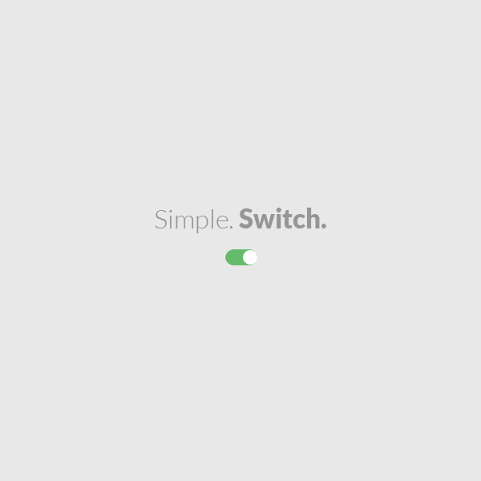

<h1>#Getting started</h1>

This is simple switch component, to make you UI simplest. Don't think about it, just use it.

`npm i @pbartkowicz/vueswitch`

or

`yarn add @pbartkowicz/vueswitch`

<h1>#Usage</h1>

Import module

<pre>
<code>
import switcher from '@pbartkowicz/vueswitch'
</code>
</pre>

Register

<pre>
<code>
components:{
    switcher,
},
</code>
</pre>

Use

<pre>
<code>
&lt;switcher v-model="yourVariable"/&gt;
</code>
</pre>

Switcher component operate on Boolean so input and output will be true/false. And that's it!
